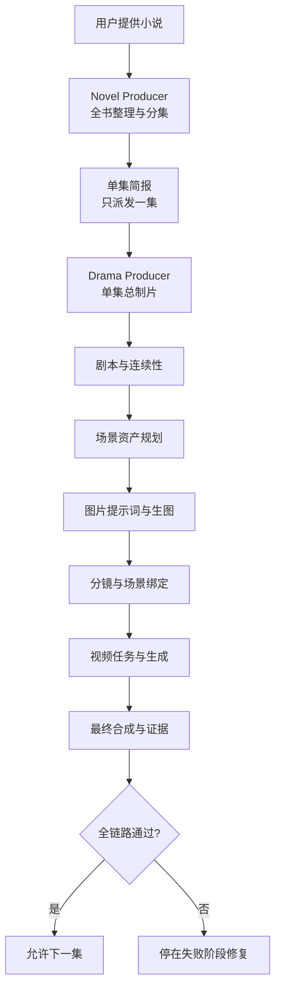

# OpenClaw Novel-to-Drama Pipeline

这是 OpenClaw 的“小说转 AI 漫剧/短剧”全自动生产套件。它把两个互相关联的 Agent 和 10 个 DeepWhite Skills 一次安装好：

- `novel-producer`：把整本小说整理成可靠的系列计划和逐集生产简报；
- `drama-producer`：接过一集简报，完成剧本、场景资产、图片、分镜、视频和成片闭环。

本仓库有两条独立安装通道：

| 分支 | 用途 | 安装内容 |
| --- | --- | --- |
| [`novel-author`](../../tree/novel-author) | 从零创作长篇小说 | Novel Author Agent + Novel Engine |
| `drama-pipeline`（当前分支） | 把已有小说连续制作成 AI 漫剧/短剧 | Novel Producer + Drama Producer + DeepWhite 技能链 |

## 一句话看懂工作逻辑

```text
用户给小说
  ↓
novel-producer：读全书、建故事档案、按事件和时长规划集数、每次只交一集
  ↓
drama-producer：把这一集变成剧本、场景图、角色/道具图、分镜、视频片段和最终 MP4
  ↓
确定性 Gate：每一步核对场景、资产、Hash、回调证据和完成状态
  ↓
本集成片验证通过后，才允许继续下一集
```

章节数不等于最终集数。一章可以拆成多集，多个短章也可以合并；系统按剧情事件、自然对白时长、动作、转场和情绪闭环决定容量。

## 完整生产流程



流程不会因为某张图或某个片段失败就从头重做整集：场景规划失败回到场景规划，图片失败只重做失败资产，视频失败只处理失败片段，合成失败先修合成。

## 各模块是干什么的

| 模块 | 通俗角色 | 实际工作 |
| --- | --- | --- |
| OpenClaw Gateway | 运行平台 | 加载 Agent、Skills 和模型，管理会话；不保存短剧业务事实。 |
| Novel Producer | 系列主编 | 读整本小说，建立人物、时间线和伏笔账本；按事件价值与屏幕容量规划集数；每次只把当前一集交给下游。 |
| Drama Producer | 单集总导演兼制片 | 组织当前集从剧本到成片的所有阶段，保存检查点，决定失败后回到哪一步。 |
| Screenwriting | 编剧 | 把单集简报变成能拍的分场剧本，给每个 Scene 稳定编号。 |
| Continuity | 场记 | 记录人物位置、服装、伤痕、道具、时间、天气和移动路线，防止下一镜无故重置。 |
| Scene Asset Planner | 场景美术统筹 | 先决定每个 Scene 具体发生在哪里、复用哪张旧场景、需要新画哪些角度；避免整集只用一个背景。 |
| Image Prompt Builder | 图片提示词设计师 | 严格按照资产计划写图像提示词；重要角色/资产按独立 9:16 单图输出多个角度，不允许一张拼图塞所有视角。 |
| Scene Pack Builder | 连续资产摄影棚 | 根据已经确定的场景和资产 ID，连续产出场景、人物、动物、生物或道具的单张多视角提示词；负责“同一资产换角度”，不负责改剧情或重新绑定场景。 |
| Asset Dispatcher | 生图任务派发员 | 校验任务和重试预算后提交 n8n；HTTP 2xx 只记为“入口收到”，不冒充生成完成。 |
| Shotlist Builder | 分镜师 | 使用实际审核通过的图片做分镜，并把每个镜头绑定到正确 Scene 和场景资产。 |
| Transition Builder | 剪辑衔接设计师 | 只在需要时设计动作、视线、声音或首尾帧桥接；不能偷偷改掉场景绑定。 |
| Video Dispatcher | 视频任务派发员 | 再次核对镜头、场景和参考资产后提交 n8n 视频任务。 |
| Pipeline Evidence | 总验收员 | 验证所有 Gate、最终 MP4、文件大小和 SHA-256；通过后才把本集标记完成。 |

举例：角色从“家中堂屋”走到“村口”。Scene Planner 会为堂屋、院落/路径锚点和村口建立明确绑定；Continuity 记录移动方向和地标；Shotlist 只能使用这些真实资产；Video Dispatcher 再核对一次。因此不会直接跳成一张毫无关系的新背景，也不会一直困在同一个房间。

## 一键安装

适用于 Linux、群晖/QNAP 等 NAS SSH 环境。需要 OpenClaw、Node.js、Python 3、`bash`、`curl` 和 `tar`。

```bash
curl -fsSL https://raw.githubusercontent.com/slobys/openclaw-novel-author-suite/drama-v1.2.0/install.sh | bash
```

安装器会：

1. 安装或更新两个 Agent Workspace；
2. 安装 10 个 DeepWhite Skills；
3. 已存在同名 Agent 时读取真实 roster 并沿用其 Workspace；
4. 覆盖公共模板前备份旧文件；
5. 永不覆盖或删除 `projects/`、`memory/`、`output/`、`.learnings/`、会话或 n8n 数据；
6. 校验 OpenClaw 配置并安全重启 Gateway。

重复执行同一条命令就是更新，不会重复创建同名 Agent。

## 安全卸载

```bash
curl -fsSL https://raw.githubusercontent.com/slobys/openclaw-novel-author-suite/drama-v1.2.0/uninstall.sh | bash
```

卸载器会把本套件的 10 个 Skills 移入带时间戳的备份目录，不直接永久删除；Agent Workspace、项目、memory、output、会话和 n8n 数据全部保留。确认不再使用后，再按你的 OpenClaw 版本手动删除两个 Agent roster 条目。

## 安装后必须配置

本套件不会把作者自己的 NAS 路径、Webhook 或密钥公开。请给 OpenClaw Gateway 配置以下环境变量：

```text
OPENCLAW_ASSET_SHARED_ROOT=/宿主机可读取的共享资产根目录
N8N_ASSET_ROOT=/data/openclaw-assets
N8N_ASSET_WEBHOOK_URL=https://你的n8n/webhook/...
N8N_ASSET_WEBHOOK_SECRET=你的密钥
N8N_VIDEO_WEBHOOK_URL=https://你的n8n/webhook/...
N8N_VIDEO_WEBHOOK_SECRET=你的密钥
```

systemd 用户服务可通过 `systemctl --user edit openclaw-gateway` 添加：

```ini
[Service]
Environment=OPENCLAW_ASSET_SHARED_ROOT=/path/to/openclaw-assets
Environment=N8N_ASSET_ROOT=/data/openclaw-assets
Environment=N8N_ASSET_WEBHOOK_URL=https://n8n.example.com/webhook/assets
Environment=N8N_ASSET_WEBHOOK_SECRET=replace-me
Environment=N8N_VIDEO_WEBHOOK_URL=https://n8n.example.com/webhook/video
Environment=N8N_VIDEO_WEBHOOK_SECRET=replace-me
```

然后运行：

```bash
systemctl --user daemon-reload
openclaw config validate
openclaw gateway restart --safe
```

更完整说明见 [配置文档](docs/CONFIGURATION.md)。

## 怎么开始

先打开 `novel-producer` Agent：

```text
我要把一部长篇小说制作成连续 AI 漫剧。请先读取完整小说，建立可追溯摘要、人物/时间线/伏笔账本，再根据剧情事件、自然对白时长、动作和情绪闭环规划集数。不要按原文章节数机械决定集数。先完成系列规划并展示结果，不要立即派发生产。
```

确认规划后：

```text
按当前系列计划开始制作第一集。每次只允许一集处于 running；严格执行 scene_bound_auto_v1.2，上一集最终 MP4 与 Pipeline Evidence 未通过前不得派发下一集。
```

## 目录结构

```text
workspaces/
├─ novel-producer/       # 系列改编、分集规划和顺序派发
└─ drama-producer/       # 单集从剧本到最终视频的状态机，内含可导入 n8n 工作流
skills/
├─ deepwhite-00-novel-series-orchestrator
├─ deepwhite-screenwriting-v1
├─ deepwhite-continuity-worldstate-zh
├─ deepwhite-scene-asset-planner
├─ deepwhite-image-prompt-builder
├─ deepwhite-scene-pack-builder
├─ deepwhite-n8n-asset-dispatcher
├─ deepwhite-shotlist-builder-zh-user
├─ deepwhite-shot-transition-builder-zh
└─ deepwhite-n8n-video-dispatcher
```

`drama-producer/integration/deepwhite-continuity/n8n/` 中包含连续资产工作流 JSON、字段契约和同步脚本。导入后仍需在你自己的 n8n 中配置凭证、共享目录挂载和 Webhook。

## 数据和隐私

公开分支不含小说正文、真实项目、memory、会话、生成结果、API Key、Webhook 密钥或作者 NAS 路径。用户运行后产生的数据留在自己的 OpenClaw/NAS 中。详见 [隐私边界](docs/PRIVACY.md)。

## 开发验证

```bash
bash tests/run-tests.sh
bash tests/test-install.sh
python3 scripts/check-public-release.py
```

## License

MIT
