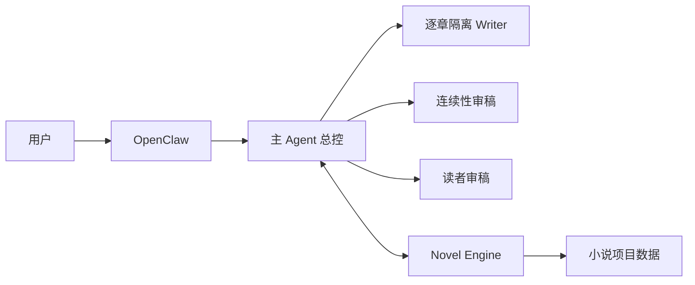
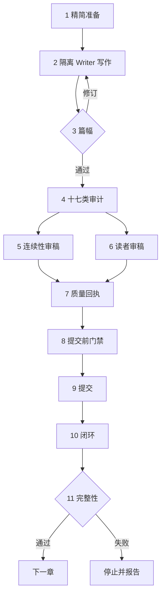

# OpenClaw Novel Author Suite

面向 OpenClaw 的长篇小说全流程套件：`Novel Engine 0.4.8` 持久化插件 + `Novel Author V5.4.1 Tool-Safe Isolation` Agent Workspace。

它提供逐章隔离 Writer、角色化精简资料包、17类随稿审计、两个低 Token 独立审稿会话、幂等取消、可恢复提交、动态状态、三级记忆、长期故事台账、Closure 与完整性检查。

## 两条公开安装通道

本仓库按用途拆成两条互不混装的分支：

| 分支 | 适合谁 | 一键安装内容 |
| --- | --- | --- |
| `novel-author`（当前套件） | 想从零创作和连续写长篇小说 | Novel Author Agent + Novel Engine |
| [`drama-pipeline`](../../tree/drama-pipeline) | 已有小说，想连续制作 AI 漫剧/短剧 | Novel Producer + Drama Producer + 10 个 DeepWhite Skills |

小说写作和小说转漫剧可以分别安装；需要两套能力时，也可以依次执行两条安装命令。

### 选择式一键安装

只需执行一条总入口命令：

```bash
curl -fsSL https://raw.githubusercontent.com/slobys/openclaw-novel-author-suite/installer-v1.4.3/setup.sh | bash
```

终端会显示：

```text
请选择操作：
  1) 安装/更新 小说创作版
  2) 安装/更新 小说转 AI 漫剧版
  3) 安全卸载 小说创作版
  4) 安全卸载 小说转 AI 漫剧版

请输入 1、2、3 或 4：
```

- 输入 `1`：只安装小说创作版；
- 输入 `2`：只安装小说转 AI 漫剧版；
- 输入 `3`：安全卸载小说创作版；
- 输入 `4`：安全卸载小说转 AI 漫剧版；
- 不会默认把两套一起安装。

安全卸载会再次要求确认，并保留小说项目、正文、`memory/`、会话、生成结果和 Workspace 备份，避免误删创作数据。

如果执行环境无法显示交互菜单，也可以直接指定：

```bash
# 只安装小说创作版
curl -fsSL https://raw.githubusercontent.com/slobys/openclaw-novel-author-suite/installer-v1.4.3/setup.sh | bash -s -- 1

# 只安装小说转 AI 漫剧版
curl -fsSL https://raw.githubusercontent.com/slobys/openclaw-novel-author-suite/installer-v1.4.3/setup.sh | bash -s -- 2

# 无交互确认：安全卸载小说创作版
curl -fsSL https://raw.githubusercontent.com/slobys/openclaw-novel-author-suite/installer-v1.4.3/setup.sh | OPENCLAW_SUITE_CONFIRM_UNINSTALL=1 bash -s -- 3

# 无交互确认：安全卸载小说转 AI 漫剧版
curl -fsSL https://raw.githubusercontent.com/slobys/openclaw-novel-author-suite/installer-v1.4.3/setup.sh | OPENCLAW_SUITE_CONFIRM_UNINSTALL=1 bash -s -- 4
```

## 系统逻辑结构

这套系统分成两层：`Novel Author` 负责创作决策与流程编排，`Novel Engine` 负责持久化、校验、事务提交和状态恢复。Agent 不能绕过 Engine 直接宣称章节已经完成。

### 组件关系



### 单章生产流程



| 流程节点 | 完整含义 |
| --- | --- |
| 1 精简准备 | 读取服务端 `nextChapter`，按 Writer/Continuity/Reader 角色只返回需要的上下文；普通章不返回重复的 full packet + full context |
| 2 隔离写作 | 每章创建一个工具受限的新 Writer session；它只返回正文、计划和17类审计 JSON，主会话负责落盘、计算 Hash 和执行 Gate |
| 3 篇幅 | 应用项目级篇幅契约；默认硬下限 2000、理想目标 2600、建议上限 3200 |
| 4 十七类审计 | 隔离 Writer 对最终正文随稿检查17类问题；主会话只做确定性结构/Hash验证，不再重复模型通读 |
| 5–6 独立审稿 | Continuity Auditor 与 Reader Editor 使用两个真实且不同的精简子会话；普通章默认低思考强度 |
| 7 质量回执 | Writer 与两个审稿会话绑定同一份正文 SHA-256，记录服务端 Quality Receipt |
| 8 提交前门禁 | 核对正文、审计、质量回执、章节号、requestId 与 Hash 是否一致 |
| 9 提交 | Novel Engine 通过幂等、CAS 和可恢复事务写入章节 |
| 10 闭环 | 更新因果、伏笔、承诺、关系、对手时钟、章节签名、动态状态和三级记忆 |
| 11 完整性 | 检查章节及所有派生记录；只有 `clean` 才把 `nextChapter` 交给下一章 |

### 各模块职责

| 模块 | 一句话理解 | 它具体做什么 |
| --- | --- | --- |
| OpenClaw Gateway | **整套系统的运行平台和总入口** | 把模型、Agent 和插件连接起来，接收用户指令，并负责创建逐章 Writer 和两个独立审稿子会话；也负责 `/stop` 与按 taskId 取消后台任务。 |
| Novel Author Agent | **总编辑 + 流程主管** | 主会话只读取状态、分配工作、验证回执和提交，不再把几十章正文堆在同一会话里。 |
| Writer Session | **每章重新上岗的独立主笔** | 只拿本章精简资料，写正文和17类随稿审计并返回结构化结果；不需要文件、命令、Novel Engine 或子会话工具。 |
| Parent Materializer | **收稿与归档员** | 主会话把 Writer/Reviewer 的真实最终回复写入 evidence，计算正文 Hash，绑定真实 session ID，再交给确定性 Gate。 |
| Continuity Auditor | **专门找前后矛盾和穿帮的审稿员** | 检查人物、时间、地点、道具、信息来源、世界规则、因果和人物关系能不能与前文对上。例如：上一章陶锅，下一章不能突然出现“铁锈味”。 |
| Reader Editor | **站在普通读者角度试读的编辑** | 检查这一章是否好读、拖沓、重复、缺少笑点或钩子，以及人物是否主动推动故事。它关注的是“读起来好不好看”。 |
| Novel Engine 插件 | **小说档案库 + 流程门卫** | 保存项目、大纲、章节、审稿结果、人物状态、记忆和长线台账；同时核对章节号、字数和正文 Hash，防止跳章、重复提交或拿错版本。 |
| Integrity Check | **每章完成后的总验收** | 提交后再核对正文、审稿、人物状态、伏笔、记忆和其他记录是否齐全且属于同一版本。只有全部通过，系统才允许开始下一章。 |

### 一章的完成标准

只有以下链路全部成功，章节才算真正完成，并允许进入下一章：

```text
Prepare → Draft → Length → 17类审计 → 两个独立审稿
→ Quality → Precommit → Commit → Closure → Integrity(clean)
```

正文每次修订都会产生新的 canonical SHA-256；17类审计、两个独立审稿、Quality、Commit 与 Closure 必须绑定同一个完整 Hash。Payload 格式错误只修 Payload，不重复进行已经通过的语义审稿。

### 为什么隔离 Writer 不需要工具

OpenClaw 的叶子子会话默认收窄会话和消息工具，这是正常安全边界。`v0.4.8` 不再要求 Writer/Reviewer 自己访问文件、执行命令、调用 `novel_*` 或创建子会话：它们只返回一个严格 JSON，主会话用真实 completion、真实 session ID 和正文内容生成文件与 Hash。这样仍然保持逐章上下文隔离，同时避免因运行时工具没有继承而在启动 Gate 误停。

历史会话里已经生成、但 Engine `commit_status=not_found` 的正文只作为候选草稿。恢复时不复活被取消的旧任务，而是把候选稿交给同一个 `nextChapter` 的新 Writer session，重新绑定审计和质量回执。

### 如何真正停止

- 立即停止当前主会话及其子任务：在发起写作的主聊天发送 `/stop`。OpenClaw 会级联停止该会话树。
- 用户发送“停止/取消”后，Agent 还会把本地 Job 写成 `cancelling`，逐个取消已登记的后台 taskId，再写成 `cancelled`。
- `cancelling/cancelled` 是持久化硬屏障：即使后来收到迟到的子会话完成通知，也不会自动恢复、重试或创建新任务。
- 如果界面停止按钮只中断了前台回合，请再发送 `/stop`，然后发送一次“停止当前小说任务”，让 Agent 完成持久化取消对账。

### 仓库目录

```text
openclaw-novel-author-suite/
├─ src/、dist/                 # Novel Engine 插件源码与运行文件
├─ workspace-novel-author/    # Novel Author Agent、Workflow、Skill 与协议
├─ skills/novel-author/       # 插件随包提供的 Skill
├─ install.sh                 # 一键安装/更新，覆盖前自动备份
├─ uninstall.sh               # 只卸载插件，保留用户数据
├─ test/、tests/              # Engine 与安装器测试
└─ docs/                      # 插件和 Agent 详细说明
```

运行后，小说项目默认保存在 `~/.openclaw/data/novels/<projectId>/`；Agent Workspace、会话和插件目录彼此分离，因此更新 Agent/插件不会删除小说数据。

## 一键安装

适用于 Linux、群晖/QNAP 等 NAS SSH 环境。安装前请先确认你信任本仓库，因为 OpenClaw 插件会在 Gateway 进程中运行代码。

```bash
curl -fsSL https://raw.githubusercontent.com/slobys/openclaw-novel-author-suite/v0.4.8/install.sh | bash
```

安装器会：

1. 从固定标签 `v0.4.8` 安装并启用 `novel-engine`，OpenClaw 2026.8.1+ 会显式完成插件能力授权；
2. 把公共 Agent 模板部署到 `~/.openclaw/workspace-novel-author`；
3. 已存在的同名 Workspace 文件先备份，不覆盖 `memory/`、`exports/`、`.novel-runtime/` 或小说数据；
4. 创建或更新 `novel-author` Agent；
5. 配置新项目默认篇幅：硬下限2000、理想目标2600、建议上限3200；
6. 校验配置并重启 Gateway；
7. 检查插件运行时注册。

要求：OpenClaw `>=2026.5.17`、Node.js `>=22.22.3`，以及 `bash`、`curl`、`tar`、`git`。

## 安装后

在 OpenClaw 中打开 `novel-author` Agent，然后可以输入：

```text
我要创建一部长篇原创小说。先完成创意设计，不要立即写正文。
```

或者续写已有项目：

```text
继续创作项目 <projectId> 的下一章。以服务端 nextChapter 为准，确认上一章 Closure 和 Integrity 后按 Balanced 流程执行。
```

## 更新

再次执行同一条安装命令即可。安装器会备份即将覆盖的 Workspace 文件，插件通过固定 Git 标签更新。

## 卸载

```bash
curl -fsSL https://raw.githubusercontent.com/slobys/openclaw-novel-author-suite/v0.4.8/uninstall.sh | bash
```

卸载只移除插件，不删除 Agent Workspace、会话或 `~/.openclaw/data/novels` 小说数据。

## 手动安装

```bash
openclaw plugins install git:github.com/slobys/openclaw-novel-author-suite@v0.4.8 --force --accept-capabilities
openclaw plugins enable novel-engine --accept-capabilities
openclaw config validate
openclaw gateway restart
openclaw plugins inspect novel-engine --runtime --json
```

手动安装插件不会复制 Agent Workspace；完整部署请使用 `install.sh`。

## 数据与隐私边界

公开仓库不包含作者的小说正文、项目数据、memory、exports、会话、OpenClaw 配置、模型凭证或 API Key。运行时小说默认保存在 `~/.openclaw/data/novels`，更新和卸载均不删除该目录。

## 文档

- [Novel Engine 技术说明](docs/PLUGIN.md)
- [Novel Author Workspace 说明](docs/WORKSPACE.md)
- [0.4.8 升级说明](UPGRADE-0.4.8.md)
- [安全策略](SECURITY.md)

## 开发验证

```bash
npm ci --omit=peer --legacy-peer-deps
npm run verify
python3 -m unittest discover -s workspace-novel-author/skills/novel-author/tests -p 'test_*.py'
bash tests/test-install.sh
```

## License

MIT
