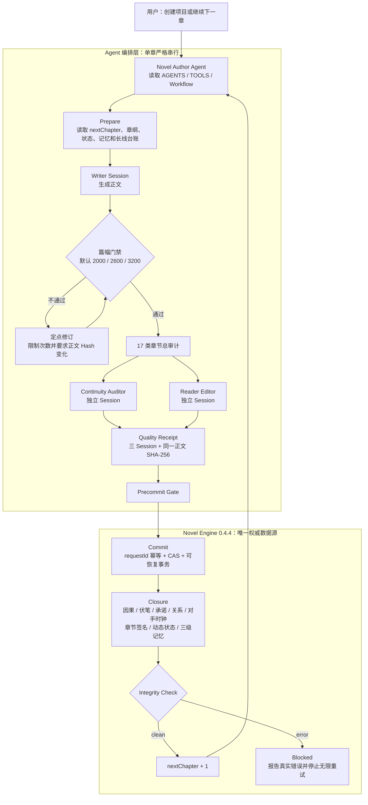

# OpenClaw Novel Author Suite

面向 OpenClaw 的长篇小说全流程套件：`Novel Engine 0.4.4` 持久化插件 + `Novel Author V5.3.2 Balanced` Agent Workspace。

它提供项目级篇幅契约、17类逻辑审计、两个独立审稿会话、可恢复提交、动态状态、三级记忆、长期故事台账、Closure 与完整性检查。

## 系统逻辑结构

这套系统分成两层：`Novel Author` 负责创作决策与流程编排，`Novel Engine` 负责持久化、校验、事务提交和状态恢复。Agent 不能绕过 Engine 直接宣称章节已经完成。



### 各模块职责

| 模块 | 主要职责 | 不负责什么 |
| --- | --- | --- |
| OpenClaw Gateway | 加载 Agent、插件和模型能力，管理主会话与子会话 | 不保存小说业务事实 |
| Novel Author Agent | 读取项目资料、写作、调用审计、组织单章状态机 | 不直接修改 Engine 中的权威状态 |
| Continuity Auditor | 独立检查事实、时间线、知识边界、状态、因果、承诺和关系连续性 | 不代替 Writer 改正文 |
| Reader Editor | 独立检查可读性、节奏、重复、类型体验、钩子和人物能动性 | 不负责世界状态记账 |
| Novel Engine 插件 | 提供 33 个 `novel_*` 工具，保存项目、正文、审计、Quality、Closure、记忆和台账 | 不替 Agent 决定故事创意 |
| Integrity Check | 核对章节及全部派生记录的正文 Hash 和闭环状态 | 不自动掩盖或忽略错误 |

### 一章的完成标准

只有以下链路全部成功，章节才算真正完成，并允许进入下一章：

```text
Prepare → Draft → Length → 17类审计 → 两个独立审稿
→ Quality → Precommit → Commit → Closure → Integrity(clean)
```

正文每次修订都会产生新的 canonical SHA-256；17类审计、两个独立审稿、Quality、Commit 与 Closure 必须绑定同一个完整 Hash。Payload 格式错误只修 Payload，不重复进行已经通过的语义审稿。

### 仓库目录

```text
openclaw-novel-author-suite/
├─ src/、dist/                 # Novel Engine 插件源码与运行文件
├─ workspace-novel-author/    # Novel Author Agent、Workflow、Skill 与协议
├─ skills/novel-author/       # 插件随包提供的 Skill
├─ install.sh                 # 一键安装/更新，覆盖前自动备份
├─ uninstall.sh               # 只卸载插件，保留用户数据
├─ test/、tests/              # Engine 与安装器测试
└─ docs/                      # 插件和 Agent 详细说明
```

运行后，小说项目默认保存在 `~/.openclaw/data/novels/<projectId>/`；Agent Workspace、会话和插件目录彼此分离，因此更新 Agent/插件不会删除小说数据。

## 一键安装

适用于 Linux、群晖/QNAP 等 NAS SSH 环境。安装前请先确认你信任本仓库，因为 OpenClaw 插件会在 Gateway 进程中运行代码。

```bash
curl -fsSL https://raw.githubusercontent.com/slobys/openclaw-novel-author-suite/v0.4.4/install.sh | bash
```

安装器会：

1. 从固定标签 `v0.4.4` 安装并启用 `novel-engine`；
2. 把公共 Agent 模板部署到 `~/.openclaw/workspace-novel-author`；
3. 已存在的同名 Workspace 文件先备份，不覆盖 `memory/`、`exports/`、`.novel-runtime/` 或小说数据；
4. 创建或更新 `novel-author` Agent；
5. 配置新项目默认篇幅：硬下限2000、理想目标2600、建议上限3200；
6. 校验配置并重启 Gateway；
7. 检查插件运行时注册。

要求：OpenClaw `>=2026.5.17`、Node.js `>=22.22.3`，以及 `bash`、`curl`、`tar`、`git`。

## 安装后

在 OpenClaw 中打开 `novel-author` Agent，然后可以输入：

```text
我要创建一部长篇原创小说。先完成创意设计，不要立即写正文。
```

或者续写已有项目：

```text
继续创作项目 <projectId> 的下一章。以服务端 nextChapter 为准，确认上一章 Closure 和 Integrity 后按 Balanced 流程执行。
```

## 更新

再次执行同一条安装命令即可。安装器会备份即将覆盖的 Workspace 文件，插件通过固定 Git 标签更新。

## 卸载

```bash
curl -fsSL https://raw.githubusercontent.com/slobys/openclaw-novel-author-suite/v0.4.4/uninstall.sh | bash
```

卸载只移除插件，不删除 Agent Workspace、会话或 `~/.openclaw/data/novels` 小说数据。

## 手动安装

```bash
openclaw plugins install git:github.com/slobys/openclaw-novel-author-suite@v0.4.4 --force
openclaw plugins enable novel-engine
openclaw config validate
openclaw gateway restart
openclaw plugins inspect novel-engine --runtime --json
```

手动安装插件不会复制 Agent Workspace；完整部署请使用 `install.sh`。

## 数据与隐私边界

公开仓库不包含作者的小说正文、项目数据、memory、exports、会话、OpenClaw 配置、模型凭证或 API Key。运行时小说默认保存在 `~/.openclaw/data/novels`，更新和卸载均不删除该目录。

## 文档

- [Novel Engine 技术说明](docs/PLUGIN.md)
- [Novel Author Workspace 说明](docs/WORKSPACE.md)
- [0.4.4 升级说明](UPGRADE-0.4.4.md)
- [安全策略](SECURITY.md)

## 开发验证

```bash
npm ci --omit=peer --legacy-peer-deps
npm run verify
python3 -m unittest discover -s workspace-novel-author/skills/novel-author/tests -p 'test_*.py'
bash tests/test-install.sh
```

## License

MIT
