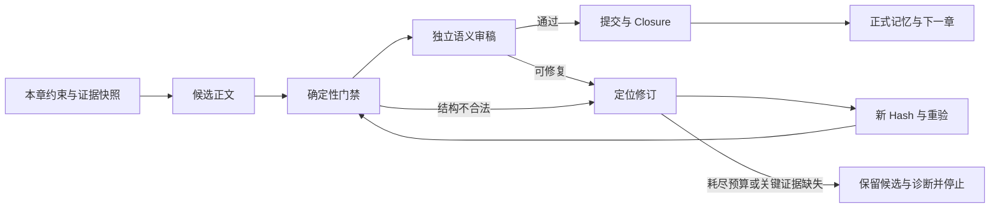

# 自动长篇小说：主线、因果、伏笔与一致性研究

研究日期：2026-10-08。角色：Researcher / 小说系统研究员。状态：首轮一手资料核验与开发建议完成；**未运行付费模型实验，未证明本项目的实际小说质量提升**。

输入：本项目 [README](../README.md)、[src/engine.js](../src/engine.js)，以及下列论文正文、论文出版页和作者公开代码。源码观察基线：`baa44498ea5f38753699d7579731597543e908a8`，Novel Engine 0.6.0。本文不审阅真实用户小说，不包含私有小说、模型凭证或运行数据。

## 1. 结论与产品目标

**建议将目标定义为“可约束、可查证、会阻断、可恢复的自动长篇创作”，而不是“任意写法永不混乱”。** 无限制自然语言、隐喻、误会、倒叙和不可靠叙述，无法由目前这些研究或本仓库的 Hash 门禁给出普遍正确性保证。

最有价值的方向不是不断增加审稿 Agent，而是让已有 Writer、Continuity Auditor、Reader Editor 共享同一份**带出处的故事状态与本章约束**：

1. 先规划本章在主线中的必要变化及其前提。
2. 按涉及实体、依赖事件、到期承诺提取历史，而非仅靠最近几章。
3. 区分事实、人物信念、作者计划和读者已见线索。
4. 对可计算规则做确定性检查；对语义判断要求原文证据与明确结论。
5. 通过后才更新正式记忆；失败局部修订并重验；无法修复时停止推进。
6. 用长期、对抗性且包含合法反转的测试持续评估，不把“流程完成”当“好小说”。

上述方向分别受计划控制、记忆检索、信念跟踪、状态转移和证据化评测研究支持；具体工程契约是本项目的设计推导，不是论文已验证的本项目功能。[Re3](https://aclanthology.org/2022.emnlp-main.296/)、[DOC](https://aclanthology.org/2023.acl-long.190/)、[DOME](https://aclanthology.org/2025.naacl-long.63/)、[SymbolicToM](https://aclanthology.org/2023.acl-long.780/)、[ConWriter](https://arxiv.org/pdf/2608.05169)、[ConStory](https://arxiv.org/html/2603.05890v1)。

### “值得推理”如何验收

这是本项目建议采用的产品定义，不冒充通用文学定律：

| 用户表达 | 可验收的系统能力 | 不能混淆的事情 |
| --- | --- | --- |
| 主线不会乱 | 主线目标、关键节拍、因果依赖和结局承诺可追踪；偏移有记录 | 有总纲文件不代表正文兑现总纲 |
| 情节有逻辑 | 重要行动有可追溯前提、人物目标与代价；结果有合法状态变化 | 先发生不自动等于造成后发生 |
| 伏笔值得回看 | 回收指向此前读者可见的具体线索，重读能够解释 | 作者内部 `payoffPlan` 不是读者实际看过的伏笔 |
| 人物不会突然全知 | 行动依据来自观察、传信或已声明推断；保留错误信念 | 世界真相不等于每个人都知道 |
| 可以自动持续写 | 门禁、预算、失败恢复、取消和修订依赖可复现 | 连续生成成功不代表语义正确率 100% |

## 2. 一手研究与适配判断

### 2.1 IPOCL：逻辑因果与人物意图是两个维度

Riedl 与 Young 的 *Narrative Planning: Balancing Plot and Character* 发表于 JAIR 2010；arXiv 镜像提交于 2014，不能按镜像日期误称 2014 年提出。IPOCL 在因果规划外加入角色目标与意图解释，研究评价关注读者能否理解人物为何行动。[论文与出版信息](https://arxiv.org/abs/1401.3841)、[原始论文](https://ed.aaai.org/Papers/JAIR/Vol39/JAIR-3905.pdf)。

- 可借鉴：区分“行动达成情节目标”和“行动符合角色当时意图”；重要事件记录 actor goal 与前提。
- 局限：符号化世界与动作模型不等于开放题材自然语言；不能把小说全部强制转成一个经典规划器。
- 适配建议（工程推导）：利用已有 causal event 的 `preconditions`、`actorGoals`、`cost`、`outcome`，补来源、引用和可核验状态；“目标变化”允许存在，但需转折证据，不能机械禁止人物成长。

### 2.2 Re3：计划、递归上下文、候选重排、事实修订

Re3 发表于 EMNLP 2022，针对 2,000 词以上故事，将总体计划、当前故事状态反复加入生成上下文，再重排候选并修订事实一致性；作者公开了实现和实验资料。[论文](https://aclanthology.org/2022.emnlp-main.296/)、[作者代码](https://github.com/yangkevin2/emnlp22-re3-story-generation)。

- 可借鉴：写作不是一次超长输出；计划与记忆在每一步重新注入，审稿后允许修订。
- 局限：原研究的篇幅、模型和实验条件，不能外推为中文数十万字连载保证；模型生成的摘要与属性也可能错误。
- 适配建议（工程推导）：保留逐章 Writer 和现有修订链；先改善输入证据质量，不先堆更多候选或更多 Agent。关键章再按预算启用候选比较，评测其成本收益。

### 2.3 DOC：有详细大纲，还要有兑现大纲的控制

DOC 预印本始于 2022 年 12 月，正式发表于 ACL 2023；由分层详细大纲和详细控制器组成。作者仓库说明原实验平均故事长度约 3,500 词，并依赖特定控制器/推理接口；另有支持聊天模型的重写版本。[论文](https://aclanthology.org/2023.acl-long.190/)、[原实现](https://github.com/yangkevin2/doc-story-generation)、[聊天模型版本](https://github.com/facebookresearch/doc-storygen-v2)。

- 可借鉴：每个大纲节拍应明确需要发生什么，而不只是一段主题描述。
- 局限：原论文的 token-level 控制不能等同当前普通聊天 API 上的 prompt；“增加大纲细节”本身不保证正文遵循。
- 适配建议（工程推导）：把大纲落为 `beatId` 与前置/必达条件；利用已有 outline-drift 台账报告 `planned / fulfilled / deferred / new`。主线锚点固定，局部细节可受控调整，不要求所有章逐字服从僵硬总纲。

### 2.4 DOME：动态大纲与按实体检索的时序记忆

DOME 预印本发表于 2024 年 12 月，正式发表于 NAACL 2025。它交替展开详细大纲和生成内容，以 `<subject, action, object, chapter-index>` 时序图存储，按实体检索再过滤相关信息，并提出冲突率分析；其主要实验使用 20 个故事前提。[论文正文 §4–5](https://arxiv.org/html/2412.13575v1)、[正式出版](https://aclanthology.org/2025.naacl-long.63/)、[作者实现](https://github.com/Qianyue-Wang/Generating-Long-form-Story-Using-Dynamic-Hierarchical-Outlining-with-Memory-Enhancement)。

- 可借鉴：检索当前章相关历史，且根据已写正文调整未展开细纲。
- 局限：抽取与相关性过滤依赖模型；章序索引并非故事内时间；小样本与冲突率不足以证明百万字稳定。作者实现使用 Neo4j，不是采用思想就必须采用该数据库。
- 适配建议（工程推导）：先在现有 JSON 台账上实现显式 ID、依赖遍历和按角色/道具/规则选择。完整性优先于“最近 8 条”；首轮不引入图数据库、向量库或新模型训练。

### 2.5 SymbolicToM / ToMi：世界状态与人物所信不可混为一谈

SymbolicToM 发表于 ACL 2023，显式跟踪人物信念、对他人信念的判断与高阶推理；ToMi 作者仓库包含真信念、未观察行动导致的错误信念、二阶错误信念场景。SymbolicToM 作者另提供修正、去歧义和语言/结构泛化数据，指出原数据存在错误标签和伪规律。[SymbolicToM 论文](https://aclanthology.org/2023.acl-long.780/)、[作者实现](https://github.com/msclar/symbolictom)、[ToMi 作者代码](https://github.com/facebookresearch/ToMi)。

- 可借鉴：人物离场后世界改变，其信念不应自动跟随；推断、证词和事实需分别表示。
- 局限：受控问答不等于开放长篇创作；更高阶信念带来额外复杂度；测试本身亦需核对标签。
- 适配建议（工程推导）：首版以一阶人物知识为主，记录 acquisition event/source、belief status、valid time；测试“离场—道具移位—返回”的原创中文案例及同义改写。没有取得事实的证据不等于证明人物必然不知道，应允许 `unknown` 和标明依据的推断。

### 2.6 CHIRON：人物卡应验证，不能只保存摘要

CHIRON 预印本始于 2024 年 6 月，发表于 Findings of EMNLP 2024。它先按问题生成丰富人物信息，再以验证模块过滤不受支持内容；主要验证任务是 masked-character prediction，而非“生成小说无矛盾”。[论文](https://aclanthology.org/2024.findings-emnlp.499/)、[作者代码与数据说明](https://github.com/Alex-Gurung/CHIRON)。

- 可借鉴：外貌/能力等原子事实之外，还需保留语气、性格、目标等带依据的丰富描述；写入记忆前验证抽取。
- 局限：人格和情绪不能全部压成固定三元组；人物卡分析效果不能宣传成写作正确率；原数据有版权/发布限制。
- 适配建议（工程推导）：人物卡采用“稳定设定 + 经证据支持的动态描述”；不要将 Writer 自己的总结直接升级为无可争辩的 canonical truth。回归使用自建短素材，不搬运未授权故事数据。

### 2.7 ConStory-Bench：将一致性变成证据化的长篇评测

ConStory 预印本提交于 2026-03-06；公开仓库称论文获 ACL 2026 接收。基准含 2,000 个提示，涵盖生成、续写、扩写和给定起止的补全，采用 5 大类/19 子类及带原文位置的矛盾报告；论文专门承认英语/西方叙事和意图性反转识别的局限。[论文](https://arxiv.org/html/2603.05890v1)、[项目页](https://picrew.github.io/constory-bench.github.io/)、[作者仓库](https://github.com/Picrew/ConStory-Bench)。

- 可借鉴：报告“前文片段 + 后文片段 + 类型 + 为何冲突”，而非只给总分。
- 局限：其注入错误诊断实验并非完美检出；二值判断可能误判合法反转，英语结论不可直接套用中文。
- 适配建议（工程推导）：取其错误分类作为测试框架；同时记录漏检、误拦、任务完成率与成本。中文的错误/万汉字应明确为本地指标，不冒充论文的错误/万英文词。

### 2.8 ConWriter：状态转移检查与局部修补

ConWriter 的页面标注 2026 年、v2 最后修订 2026-09-04，称获 Findings of EMNLP 2026 接收；本研究以当前 PDF 为依据。其方法区分静态承诺与动态记忆，按场景生成，检查前置条件、后置条件和禁止变化，再局部修补。实验为四类任务每类前五例、多个篇幅与模型，样本仍有限。[当前论文 PDF](https://arxiv.org/pdf/2608.05169)、[版本信息](https://arxiv.org/abs/2608.05169)、[作者代码](https://github.com/jindongli-Ai/ConWriter)。

- 可借鉴：不是只问“这一章有没有问题”，而是问“这一段是否实现合法状态转移”。
- 局限：检索、验证、修补增加开销；纠错遵循能力因模型而异；logit/entropy 信息未必由现用模型接口提供。作者 README 指出存在无 API 的确定性 fallback 且评测工具另置，不能把跑通示例当论文复现。
- 适配建议（工程推导）：把状态转移检查挂在现有提交门禁，不先替换 Writer 编排。风险调度用本地可观察因素（逾期承诺、跨章实体、重大规则变化）；模型不给概率时不伪造熵值。

## 3. 现有能力与缺口：必须分清存储、校验、语义

以下仅为研究适配所需的定点源码观察，不代替 TechLead 的全面代码审查。链接固定到研究基线，避免后续修改导致结论漂移。

| 方向 | 已有能力 | 基线可见的不足 / 待验证项 | 优先适配 |
| --- | --- | --- | --- |
| 流程与版本 | 独立 Writer/Reviewer、审计、Quality、Commit、Closure、Integrity；正文 SHA-256 绑定 | 这些证明报告针对同一版正文，不证明模型结论正确 | 保留原门禁，新增语义证据链，不重造编排 |
| 因果 | `recordCausalEvent` 存 preconditions、causes、enables、actorGoals 等；拒绝自引用 | 此入口未见完整引用存在性、间接循环、原因状态可用性校验 | 验证图结构及状态；自然语言前提另交审稿 |
| 伏笔 | planned/open/advanced/paid/cancelled，期限、读者/人物 awareness、正文绑定 | 状态枚举与当前源章 Hash 不等于合法生命周期或实际埋设/回收证据 | 加转移规则与来源历史；逾期显式决策 |
| 长线承诺 | promises、outline-drift、arc-audit 等台账已存在 | 记录 fulfilled/paid 不自动证明正文兑现；不能当作未开发能力再造一套 | 增强证据与交叉约束 |
| 人物知识 | dynamic knowledge 以 knowerId/factId 或 knowledgeKey 索引 | update 合并任意对象，未见取得信息路径和真相/信念分层的强契约 | 一阶知识来源；保留 unknown/误信 |
| 快档上下文 | 分角色预算与一次准备快照；最近窗口、条目剪裁 | dynamic 默认每集合取最近 8 项；伏笔各桶最多 10 项；旧关键事实可能被漏掉 | required context + entity/dependency retrieval + 明确缺失清单 |
| 完整性 | 检查正文及派生记录 Hash 是否同源 | binding clean 不等于因果、伏笔、知识语义 clean | 独立报告结构完整性与故事语义质量 |

源码依据：[快档剪裁与审计分类](https://github.com/slobys/openclaw-novel-author-suite/blob/baa44498ea5f38753699d7579731597543e908a8/src/engine.js#L41)、[因果/伏笔入口](https://github.com/slobys/openclaw-novel-author-suite/blob/baa44498ea5f38753699d7579731597543e908a8/src/engine.js#L1529)、[动态状态](https://github.com/slobys/openclaw-novel-author-suite/blob/baa44498ea5f38753699d7579731597543e908a8/src/engine.js#L1733)、[审稿资料选择](https://github.com/slobys/openclaw-novel-author-suite/blob/baa44498ea5f38753699d7579731597543e908a8/src/engine.js#L1888)、[全项目绑定检查](https://github.com/slobys/openclaw-novel-author-suite/blob/baa44498ea5f38753699d7579731597543e908a8/src/engine.js#L3029)。

## 4. 可落地契约：以下是建议，不代表已经实现

### 4.1 四类信息和两种时间

- **Canonical facts**：已确认的世界事实；稳定规则与可变化属性分开。
- **Beliefs**：人物当时所知/所信；可错、可不完整。
- **Plans / obligations**：作者希望未来发生的事件、承诺和回收；不能混入已发生事实。
- **Reader evidence**：读者在正文已见的线索；作者内部秘密设定不是可推理的证据。
- **叙述顺序**：章节与文本位置，用于“读者何时看到了”。
- **世界时间**：故事内时间/偏序，用于“人物当时是否有能力、消息是否已经到达”。

两种时间不能仅用 chapter number 代替。第 20 章倒叙的事件可以发生于第 3 章以前；“杀人之后才买凶器”需要在世界时间检查，“揭晓之后才补写给读者的线索”需要在叙述顺序检查。这是依据 DOME 的章索引局限、SymbolicToM 的观察边界和 ConStory 的时间/意图局限做出的工程区分。[DOME](https://arxiv.org/html/2412.13575v1)、[SymbolicToM](https://aclanthology.org/2023.acl-long.780/)、[ConStory Limitations](https://arxiv.org/html/2603.05890v1)。

### 4.2 因果图：硬约束不等于完整因果推理

先做可确定计算的部分：

1. 引用 ID 存在，边方向一致，无自指或未声明的依赖环。
2. 已发生事件的必要原因不能仅 planned 或 cancelled；需区分因果引用和未来计划依赖。
3. 批量收尾先校验整个候选增量，避免同一批内先后写入造成假缺失或部分成功。
4. 角色意图、前提与状态变化有可定位出处；不把自然语言字符串的存在当“前提已满足”。
5. 同章多个事件可有合法顺序；倒叙不因章节号逆序被拒绝。时间旅行/回溯题材要显式表示特殊世界规则，不能靠放开所有环解决。

语义层判断“理由是否足够”“选择是否符合角色”仍由带证据审稿处理。可检查的结构与需模型判断的语义分别返回，不能一个 `pass` 掩盖两者差异。该分工受 IPOCL 的因果/意图区分和 ConWriter 的前置/后置转移结构启发。[IPOCL](https://arxiv.org/abs/1401.3841)、[ConWriter §2](https://arxiv.org/pdf/2608.05169)。

### 4.3 伏笔、承诺与公平回收

建议用保留历史的状态机；精确枚举由 TechLead 与兼容性评估决定：

`planned → planted/open → reinforced/advanced → partial（如适用）→ paid`

取消和延期是独立的有理由决策，不能为通过门禁批量自动取消。允许同章合法埋设与回收，但正文中的 seed 位置应早于 payoff。默认禁止把已回收随意改回 planned；修订是版本化操作，不是静默覆盖。

每项回收建议同时关联：

- 初次埋设原文位置、源章与 Hash；重要强化证据；
- 解答/兑现原文位置、源章与 Hash；
- 已满足前提，以及人物/读者分别已知的信息；
- 该回收解释什么疑问，是否依赖揭晓时才新增的关键规则；
- 逾期时明确 `兑现 / 延期与新期限 / 取消与正文解释`，不因逾期必然编造回收。

**公平推理契约是本项目设计推导，以上论文未提供可直接套用的完整伏笔定理或算法。** 伏笔的主题/情感型回收不必满足推理谜题的唯一解；应按题材声明 strong obligation 与 soft motif，避免把所有隐喻都列为硬任务。分类和证据审稿受 ConStory 的 abandoned plot、因果及意图性反转局限启发。[ConStory 论文与分类](https://arxiv.org/html/2603.05890v1)、[官方分类代码](https://github.com/Picrew/ConStory-Bench/blob/main/constory/metrics.py)。

### 4.4 人物知识与叙事视角

建议最小记录：`knowerId / factId / epistemicStatus / acquisitionEventId / evidenceRef / validFrom / validUntil`。这些是建议字段，不是现有公开 API 的承诺。

- 事实更新不自动传播给所有角色。
- 收到消息、亲眼观察、做出推断是不同取得路径；推断可以错。
- 第三人称叙述向读者透露的信息，不自动授予场内人物。
- 人物讲谎话、误会和不可靠叙述，不自动修改 canonical fact。
- 本轮不实现无限阶嵌套信念；先用一阶+必要的二阶样例验证价值。

这套分层受 SymbolicToM 启发；加入文本锚点和状态有效期是工程适配，仍需抽取质量评测。[SymbolicToM](https://aclanthology.org/2023.acl-long.780/)、[ToMi 场景类型](https://github.com/facebookresearch/ToMi)。

### 4.5 有预算但不静默遗漏的资料包

先选择不可丢信息：当前人物/道具状态、相关不可变规则、主线锚点、当前关键 beat 的依赖、逾期/本章必须处理的承诺、所需来源片段，再放最近内容与风格摘要。

建议资料包附 manifest：选中 ID/版本、必须 ID、被省略项、预算限制、缺失/陈旧/冲突来源。必需证据装不下时应拆场景、补取相关片段或暂停，而非把 `truncated` 当“正常通过”。Writer 与 Reviewer 的视角包可以不同，但必须共享约束 ID 与同一快照。

该策略是 DOME 的实体相关检索和 DOC 的节拍控制在当前 Balanced-Fast 预算下的适配；不要求每章重读全书。[DOME §4.2](https://arxiv.org/html/2412.13575v1)、[DOC](https://aclanthology.org/2023.acl-long.190/)。

### 4.6 证据化审稿、失败修复与旧章修订

建议语义问题报告包含：`category / constraintId / priorEvidence / currentEvidence / explanation / severity / proposedRepair / uncertainty`；原文证据用源章、Hash 和准确文本位置锚定。应确定 UTF-16、Unicode 码点或 UTF-8 byte 的偏移单位并测试；不能模糊写“第几字”。

工程要求：

- failed / unknown / unavailable 不能映射成语义 pass；格式修复与正文修订区分。
- 每次改正文都重新绑定审稿和派生状态；无需改正文的 payload 修复不重跑已通过审稿。
- 明确语义修订轮数、调用/token/时间预算，达到上限保留诊断；不无限自动重试。
- 正文已提交但 Closure 未完成时恢复收尾，不能重新生成一章或继续下一章。
- 取消屏障高于迟到完成通知，不擅自恢复已取消任务。
- 修订旧章后，用依赖图找受影响后章、人物状态、线索和承诺，标记需重验；本轮不自动批量重写用户小说。
- 更新正式状态前先验证；候选稿抽取保存在 candidate state，不能污染下一章依据。

局部修订受 Re3/ConWriter 启发；幂等、取消与 Closure 规则应沿用本项目已实现机制，跨章失效传播是新增工程建议，不是宣称论文已经解决本项目故障。[Re3](https://aclanthology.org/2022.emnlp-main.296/)、[ConWriter](https://arxiv.org/pdf/2608.05169)、[本项目流程与恢复说明](../README.md)。

## 5. 对抗验收样例

以下为自建案例设计，**不是已运行测试或实验结果**。D 表示结构化输入可确定性判断；S 表示需要正文证据与语义裁决；DS 表示两层均需覆盖。首轮仅选与实际实现相匹配的测试，不将未实现项伪报通过。

| ID | 案例 / 对抗方式 | 预期 | 层与优先级 |
| --- | --- | --- | --- |
| C01 | 已发生事件 causes 指向不存在的 ID | 拒绝，错误中列出引用与事件 | D / P0 |
| C02 | A 的原因是 B，更新 B 的原因又为 A | 拒绝间接循环，而非只拒绝自指 | D / P0 |
| C03 | 事件依赖 cancelled 原因却宣称已经发生 | 拒绝不可用依赖 | D / P0 |
| C04 | 同章先取得钥匙再开门，批量提交顺序颠倒但依赖完整 | 按候选集合验证，应可通过 | D / P0 |
| C05 | 第 20 章倒叙解释第 3 章起因 | 不因 chapter-number 逆序误拦；依赖关系仍需合法 | DS / P1 |
| F01 | 仅 planned 的伏笔没有埋设证据，被直接改为 paid | 拒绝，或进入专门证据化同章埋设/回收路径 | DS / P0–P1 |
| F02 | 伏笔已 paid，普通 upsert 又改回 planned | 拒绝非修订回退；不覆盖历史 | D / P0 |
| F03 | 揭晓凶手时首次声明“只有凶手能开门”，此前无规则/线索 | 识别事后新增关键前提；不能凭 payoffPlan 判通过 | S / P1 |
| F04 | 逾期线索有明确延期原因、新期限与正文承接 | 可通过显式决策；不能强迫假回收 | DS / P1 |
| F05 | 原来人物说“没有兄弟”，后文揭示她在撒谎，前文有隐瞒迹象 | 合法反转正例，不能直接当事实矛盾 | S / P1 |
| K01 | 小林放钥匙后离场，小周移走；小林返回直接去新位置且无消息来源 | 识别知识越界 | S / P1 |
| K02 | 同场景，但小林后来收到小周短信 | 正例通过，并记录取得路径 | DS / P1 |
| K03 | 叙述者告诉读者密室密码，人物从未听见却使用 | 识别叙述者知识泄漏 | S / P1 |
| K04 | 人物误信假密码并尝试失败；世界真密码未变 | 正例通过，belief 与 fact 不互相覆盖 | DS / P1 |
| M01 | 第一章旧角色的重要伤病；再加入超过 8 项无关新状态，当前章用到该角色 | 旧事实必须进入相关上下文；不因“最近 8”遗漏 | D / P0–P1 |
| M02 | 11 个到期伏笔，本章明确依赖第 11 个 | 必须保留该 ID 或报告预算不完整，不静默丢失 | D / P0–P1 |
| M03 | 第 1/5/20 章分别放置相同关键事实，正文同义改写 | 分位置报告检出率，避免仅近邻匹配 | S / P1 |
| R01 | 修稿删掉伏笔种子，但 payoff 仍指向旧 Hash/位置 | 失效、阻断受影响链，不复用旧通过回执 | D / P1 |
| R02 | 提交成功后进程中断，再用同一 requestId 收尾 | 正文不重写、无重复事件，Closure 可继续 | D / P0 回归 |
| R03 | 一位 Reviewer 超时或 JSON 损坏，另一位已通过 | 不整体通过；已通过结果仅在版本一致时保留 | D / P0 回归 |
| R04 | cancelling 后收到迟到完成；恢复时扫描待任务 | 不创建新 Writer、不继续下一章 | D / P0 回归 |
| T01 | 角色受伤后有治疗与时间跨度再康复 | 合理变化正例，不把旧状态永久冻结 | S / P1 |
| T02 | 列出的货币总额与正文交易后余额矛盾 | 定量和证据两层检查，不能只作关键词匹配 | DS / P1 |
| A01 | 长篇中间章反复支线扩展，核心目标一直未推进 | checkpoint 报告主线漂移，局部流畅不能替代兑现 | S / P2 |

依据：错误类别参照 [ConStory 官方 taxonomy](https://github.com/Picrew/ConStory-Bench/blob/main/constory/metrics.py)，知识场景参照 [ToMi 类型](https://github.com/facebookresearch/ToMi)和 [SymbolicToM 泛化设计](https://github.com/msclar/symbolictom)；具体中文内容、期望和工程用例为本项目自建。

## 6. 评测口径与防止“指标漂亮、小说仍乱”

### 6.1 首轮分成两条结果线

**工程线**：结构/引用/生命周期正确性、幂等恢复、取消、现有回归兼容性。对限定测试集可要求全部必要用例通过；不把此数量转换为文学正确率。

**语义线**：不同题材和篇幅的盲评、证据标注和对抗案例，分别统计：

- 严重矛盾的 precision / recall；合法反转与合理状态变化的误拦率。
- 主线重要节拍兑现率，关键因果证据覆盖率。
- 到期强承诺兑现/显式延期/合理取消分布；读者线索可追溯比例。
- 角色知识越界率，抽取事实的不受支持比例。
- 完成率、实际字数、修订轮数、失败停止原因、调用/token/时延。
- 人工“读得懂、人物有目的、线索公平、节奏好”的分项评价，不以一致性取代趣味。

没有原文证据的“全通过”不能算已检测到零错误；检查器故障也不能计零错误。

### 6.2 ConStory 指标不能直接照抄

论文的 CED 意图是按篇幅归一化错误数；本文建议中文另定义 `confirmed_error_instances / (Han_characters / 10000)`，明确记为本地 `CED-Han`，同时展示总错误实例数与篇幅。不要用 `text.split()` 计算中文小说长度。[ConStory 论文 §3.2 / Appendix C](https://arxiv.org/html/2603.05890v1)。

核验作者当前 `metrics.py` 后发现，`compute_ced_single` 的 `ec` 累加**包含错误的子类单元格数量**，并非每格 JSON 内全部错误实例数；总体取各故事密度的均值，分类密度则使用汇总比值。`count_errors_in_cell` 虽存在，但这段 CED 计算未用它。**复现实验时必须固定代码版本、错误计数与聚合口径**，不能把“子类出现密度”与本地“实例密度”并表。[官方实现](https://github.com/Picrew/ConStory-Bench/blob/main/constory/metrics.py)。

GRR 是同一任务组内根据长度与错误构造的相对排名，候选集合变化会改变分数；它不是绝对可靠率。文章正文和示例的聚合解释、项目页与论文的检查器阶段数亦有表述差异，优先以固定版本代码与明确报告定义复现；本项目不复述未经独立复算的模型排行榜。模型 Judge 判定不应充当唯一真值，留出独立人工核验集。[论文](https://arxiv.org/html/2603.05890v1)、[项目页](https://picrew.github.io/constory-bench.github.io/)、[代码](https://github.com/Picrew/ConStory-Bench/blob/main/constory/metrics.py)。

### 6.3 后续比较实验

建议使用原创中文素材，冻结测试集，做 paired comparison：同一前提/题材/章数、模型版本、采样设置与预算比较 baseline 和候选系统。

1. 先跑少量短场景校准标注与误拦，不能据此宣传长篇可靠。
2. 再分别跑生成、续写、扩写、给定结局补全；按 5/20/50 章做不同跨度实验，记录实际完成长度。
3. 对关键事实位置、叙事视角、角色数量、依赖跨度、同义表达作 controlled perturbation；合理正例和错误反例成对。
4. 将未完成、超预算、被门禁阻断的作品保留在分母中，单列结果，不静默删除“困难项目”。
5. 一部分评测采用不同于 Writer 的 Judge；将 Judge 分歧、抽取错、反转误判归入诊断，不多数投票冒充真理。
6. 做消融：仅新结构门禁、仅相关上下文、两者组合、再加证据审稿；判断增益是否来自真实机制。

样本数、验收阈值和付费模型成本需先基线测量再确定；本报告不虚构提升百分比或质量承诺。跨度建议为本地实验设计，不是引述论文已经验证 50 章。

## 7. 持续优化路线与交接

| 阶段 | 建议交付 | 验收与停止边界 |
| --- | --- | --- |
| P0 首轮 | 现有 JSON 台账的因果引用/环/状态门禁、伏笔生命周期约束；错误返回可解释；原收尾/取消回归 | 由 TechLead 按缺陷证据选择最小改动，QA 独立复核；保留旧格式兼容性，不迁移真实数据 |
| P0–P1 | 必需上下文 ID 与缺失诊断；按实体/依赖保留旧重要事实 | M01/M02 等对抗案例证明不被 recent slice 静默丢弃；超预算显式停止/拆分 |
| P1 | 原文证据 schema、一阶人物知识来源、种子/强化/回收来源链、逾期承诺决策 | 正例与反例均验收；不能只测“坏例被拦” |
| P1 | 旧章修改依赖失效、candidate state、局部修订预算 | 失效范围可解释；不自动批量重写历史小说 |
| P2 | 按卷主线/人物弧/承诺审计、中文长篇评测 runner 与人工抽样 | baseline 对照、指标口径固定，错误/完成/成本并报 |
| P2–P3 | 风险自适应资料/审稿、候选重排、可观察的不确定性信号 | 先消融证明收益再扩大；没有概率接口不实现虚假 entropy |

**本轮不做**：更换 OpenClaw/Novel Engine 架构，新增独立写作平台、UI 重构、图数据库、全模型训练、影视/漫剧功能、生产安装或部署。这些不是研究推荐的首轮必要条件。

角色交接：

- ProductManager：将“永不混乱”转换为上述可测目标，保留边界与持续优化 backlog。
- TechLead / BackendEngineer：参照 §3–4，结合实际源码审查制定最小门禁方案；本文不是已批准的全部接口规格。
- QAEngineer：将 §5 分成已实现与后续契约用例，首先验证 P0；用结构规则通过/语义评测通过两份结果避免误报。
- 研究后续：语义/长篇实验先建立固定模型与原创标注基线，再评估成本和收益；当前只有文献与源码观察，没有生成评测结果。

## 8. 风险、记录与完成状态

- 研究完成产物：本文件；未改代码、未新增测试、未提交/推送/部署。
- 研究结论：优先增加可计算约束和必需证据完整性，随后补语义证据、知识边界、回收公平性与修订依赖。
- 主要风险：模型抽取错误、Judge 漏检/误拦、旧数据兼容、上下文过度压缩、局部修补伤害全局逻辑、严格门禁导致“停得正确但不再产出”。
- 未验证：本仓库任何改进在中文真实长篇的效果；研究方法在现用模型、实际预算和题材的可迁移性。
- 下一行动：将此文档交给 TechLead 和 QA 作为首轮门禁与后续语义验收的共同依据，由父任务统一维护 STATUS/LOG 与实施顺序。

### 研究记录

- 2026-10-08：读取公司 RULES.md、research 技能、项目 STATUS 与公开仓库 README；定点阅读 Engine 的因果、伏笔、动态状态、快档资料与完整性入口。
- 2026-10-08：核验 IPOCL、Re3、DOC、DOME、SymbolicToM/ToMi、CHIRON、ConStory、ConWriter 的原始出版/正文和作者公开实现；未安装或运行第三方代码。
- 2026-10-08：形成能力/缺口映射、分层契约、24 项自建对抗/恢复样例和 P0–P3 优化顺序；回报父任务首轮建议和指标口径风险。

访问时间均为 2026-10-08。作者仓库 `main` 可变；未来复现需记录当次源码 commit、论文版本、Judge/Writer 版本与完整参数。本文件的本项目源码观察已固定 commit，不会把后续修改误称为初始能力。
